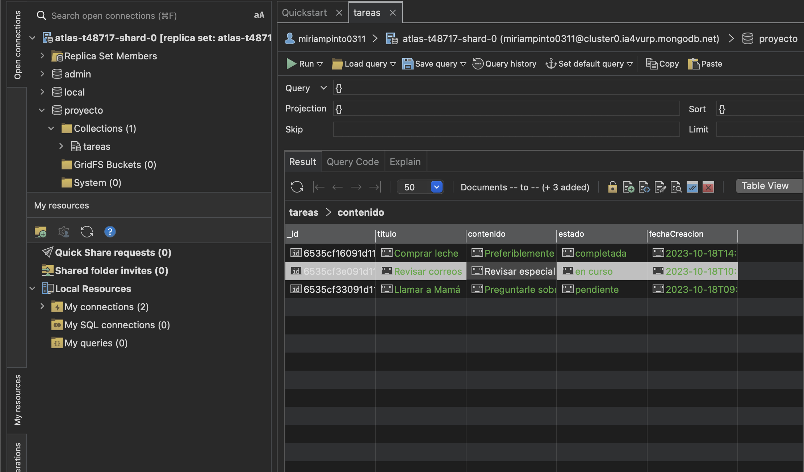

# Clúster MongoDB Atlas



## Comandos con mongoose

### Configuración de mongoose

```js
const mongoose = require('mongoose');

mongoose.connect(<cadena-de-contexion>, { useNewUrlParser: true, useUnifiedTopology: true });

const TareaSchema = new mongoose.Schema({
  titulo: String,
  contenido: String,
  estado: { 
    type: String,
    enum: ['pendiente', 'en curso', 'completada'],
    default: 'pendiente'
  },
  fechaCreacion: {
    type: Date,
    default: Date.now
  },
});

const Tarea = mongoose.model('Tarea', TareaSchema);
```

### Operaciones

* Read
  ```js
  Tarea.find()
    .then((tareas) => console.log(tareas))
    .catch((error) => console.error(error));

  Tarea.findOne({ estado: 'completada' })
    .then((tarea) => console.log(tarea))
    .catch((error) => console.error(error));

  ```

* Update

  Cambiar el estado de `Comprar leche` a `pendiente`
  ```js
  Tarea.findOneAndUpdate(
    { titulo: 'Comprar leche' },
    { estado: 'pendiente' },
    { new: true }
  )
    .then((tarea) => console.log(tarea))
    .catch((error) => console.error(error));
  ```

* Delete
  ```js
  Tarea.findOneAndDelete({ titulo: 'Comprar leche' })
    .then((tarea) => console.log(
      `Eliminada la tarea: ${tarea.titulo}`
    ))
    .catch((error) => console.error(error));
  ```
