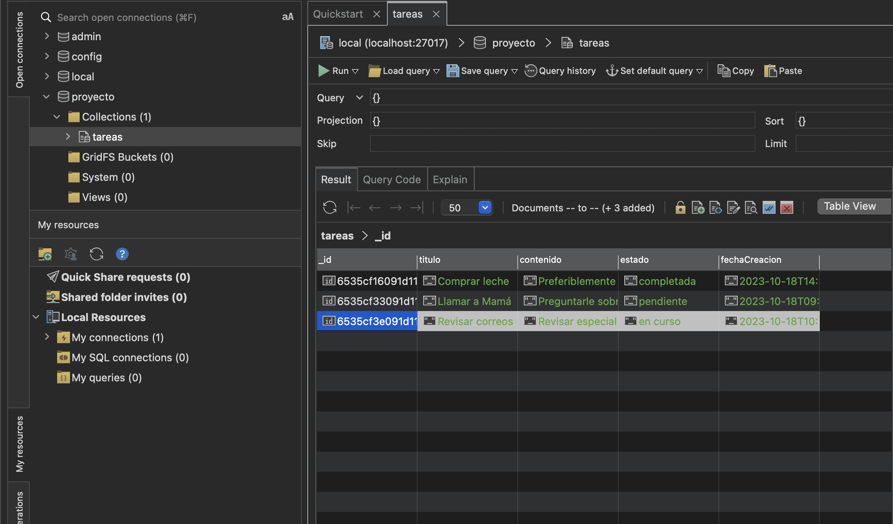

# Creando tu base de datos usando MongoDB



## Comandos

- **Read** 
  ```sh

  db.tareas.find()

  db.tareas.find({ estado: "completada" })
  ```

- **Update**

  ```sh

  db.tareas.update(
    { titulo: "Comprar leche" }, 
    { $set: { estado: "pendiente" } }
  )

  db.tareas.updateMany(
    { estado: "completada" },
    { $set: { estado: "pendiente" } }
  )
  ```

- **Delete**

  ```sh
  db.tareas.remove({ titulo: "Comprar leche" })
  ```